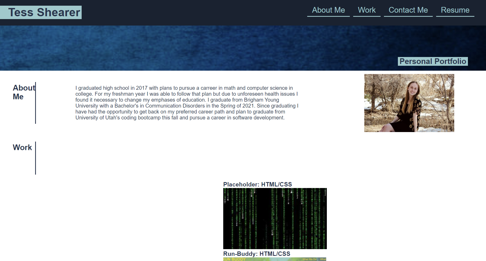

# Portfolio

# <Professional-Portfolio>

## Description

Employers would like to be able to easily learn more about me. This includes an example of my website creating abilities, which I am providing by creating this portfolio! This also includes links to my previous and upcoming work. I have included a description of myself as well as a picture, contact information, and a resume. With all of this provided and easily readable and accessible I will be more attractive to potential employers.

## Usage

Visit the finished product here: https://tessshearer.github.io/Portfolio/

## Credits

I created and finished this project on my own.

